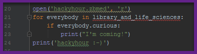

# About
Come to talk about code, tools and science, in a social environment. If you have a problem in one of those areas: bring it along and get help. If you want to know how computational tools and code can improve your science or you just want to drink a coffee: join us.
The HackyHour is open to all intrested librarians and scientists of the Cologne area and beyond.  

# When and Where

Our meeting takes place on Thursdays from 2-3pm in the Meeting Room at [ZB MED] (https://www.zbmed.de/).

You can come without registration but feel free to join the discussion in the linked pad (see table below) if you have any questions beforehand.

# Topics
In addition to the open discussions we also aim to talk about specific topics at each HackyHour.
However prior knowledge or interest in these topics is not a prerequisite. Online discussions for these topics are accessible via the following links.

| Date       | Summary          | Discussion                                                                                                                             |
| --------- | --------------    | ----------:                                                                                           
|2019-01-10 | Raspberry Pi! (Eva S.)| [issue], [pad](https://hackmd.io/vEbxzc_hTi63myj-0igFjg#)|  
|2019-01-03 | Cancelled due to new years hangover                 | [issue], [pad](https://hackmd.io/vEbxzc_hTi63myj-0igFjg#)|
|2018-12-27 | Cancelled due to boxing week | [issue], [pad](https://hackmd.io/vEbxzc_hTi63myj-0igFjg#)|
|2018-12-20 | tba | [issue], [pad](https://hackmd.io/vEbxzc_hTi63myj-0igFjg#)|
|2018-12-13 | Text editors (Emacs (Konrad), PyCharm (Silvia, Muhammad), Atom (Christian Kurrat), notepad++ (Eva S.),  Vim (?))| [issue], [pad](https://hackmd.io/vEbxzc_hTi63myj-0igFjg#)|          
|2018-12-06 | Cancelled due to Christmas party | [issue], [pad](https://hackmd.io/vEbxzc_hTi63myj-0igFjg#)|
|2018-11-29 | Versorgungslandkarte (Christoph) | [issue], [pad](https://hackmd.io/vEbxzc_hTi63myj-0igFjg#)|
|2018-11-22 | "Selenium" browser framework | [issue], [pad](https://hackmd.io/vEbxzc_hTi63myj-0igFjg#) | 
|2018-11-15 | Help yourself with Library Carpentry websites: basic SQL; Crossref Tool | [issue], [pad](https://hackmd.io/vEbxzc_hTi63myj-0igFjg#)| 
|2018-11-08 | Founding Meeting | we need to end at 2:55pm [issue](https://github.com/HackyHour/Cologne/issues/1), [pad](https://hackmd.io/vEbxzc_hTi63myj-0igFjg#) |

# More topics
 Kongress-Kalender und PINOAQ (Lara Schruff?) 

 Web of Science Databsses (Eva S.) 

 Wikidata (Muhammad) 

# Code of Conduct
In favour to ensure an agreeable atmosphere for everybody all participants are expected to respect each other, their questions and the different ways of contributing and learning regardless to gender, age, race or status of knowledge.

Our rules of conduct takes up the Code of Conduct of [The Carpentries](https://docs.carpentries.org/topic_folders/policies/code-of-conduct.html).

# Inspiration
This project is inspired by [HACKYHOUR@AUCKLAND](https://uoa-eresearch.github.io/HackyHour/) and the [R Study Group](http://minisciencegirl.github.io/studyGroup/).

# License
The content of this website is available under [CC0](LICENSE).
This website uses the [hacker template](https://github.com/pages-themes/hacker/) which is also available under [CC0](https://creativecommons.org/publicdomain/zero/1.0/legalcode).
